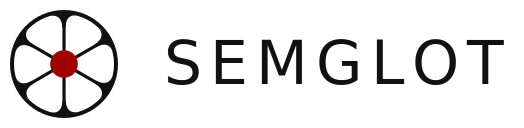

<p align="center">
  
</p>

<p align="center">
  <em>A semantic-layer transpiler: one neutral IR, many dialects.</em>
</p>

---

Where [`sqlglot`](https://github.com/tobymao/sqlglot) translates across SQL
dialects, **semglot** translates across **semantic-layer dialects** (dbt
semantic models, Snowflake Cortex, Snowflake semantic views, and more) through
one neutral intermediate representation (IR).

You point it at a source layer, pick a target dialect, and it writes the
equivalent layer out. Because everything routes through the IR, adding a dialect
adds every conversion into and out of it, not just one.

## Semantic Layer Dialects

A **source** is read into the IR; a **target** is written from it. `dbt` is
both, so `dbt` to `dbt` is a lossless round-trip.

| Dialect                   | Source | Target |
|---------------------------|:------:|:------:|
| `dbt`                     |   ✓    |   ✓    |
| `cortex`                  |        |   ✓    |
| `snowflake-semantic-view` |        |   ✓    |
| `supersimple`             |        |   ✓    |
| `nao-yaml`                |        |   ✓    |
| `nao-context-rules`       |        |   ✓    |

Adding a dialect is small, self-contained work: implement the `Layer` interface
(`Parse`, `Emit`, or both) and register it, and every conversion to and from it
comes for free. Missing one you need? Please
[open an issue or PR](https://github.com/benchouse/semglot/issues).

## Install

```sh
go install github.com/benchouse/semglot/cmd/semglot@latest
# or, from a clone:
go build -o semglot ./cmd/semglot
```

## Usage

`build` transpiles a source semantic layer into a target dialect. Builds are
configured with named **profiles** in `semglot.yaml`:

```yaml
# semglot.yaml
profiles:
  catalog:
    source: ./models
    target-dialect: snowflake-semantic-view
    output: ./out
    database: ANALYTICS
    model-name: catalog
```

Given a small dbt table:

```yaml
# models/schema.yml
models:
  - name: dim_product
    description: Product dimension.
    columns:
      - name: product_id
        description: Product surrogate key.
        data_type: number
        constraints:
          - type: primary_key
      - name: category
        description: Product category.
        data_type: varchar
      - name: title
        description: Product title.
        data_type: varchar
```

run the profile:

```sh
semglot build --profile catalog
```

semglot writes `out/definition.md` with the create statement:

```sql
create or replace semantic view CATALOG
	tables (
		DIM_PRODUCT as ANALYTICS.MAIN.DIM_PRODUCT primary key (PRODUCT_ID) comment='Product dimension.'
	)
	dimensions (
		DIM_PRODUCT.PRODUCT_ID as dim_product.PRODUCT_ID comment='Product surrogate key.',
		DIM_PRODUCT.CATEGORY as dim_product.CATEGORY comment='Product category.',
		DIM_PRODUCT.TITLE as dim_product.TITLE comment='Product title.'
	)
;
```

### Options

- `--profile <name>` selects a profile from the config. Required.
- `--config <path>` points at the config file. Defaults to `./semglot.yaml`.

Anything a target dialect can't express is reported rather than dropped silently
(e.g. a `NOTES.md` sidecar listing metrics that don't map).

## Configuration

A profile is a complete, self-contained build. Every field:

```yaml
# semglot.yaml
profiles:
  view_prod:
    source: ./models              # required. dbt source dir, or a list of dirs
    source-dialect: dbt           # optional. default: dbt
    target-dialect: snowflake-semantic-view   # required
    output: ./out/view            # required. directory to write into
    database: ANALYTICS           # required for Snowflake targets (cortex, snowflake-semantic-view)
    schema: SEM                   # optional. default: MAIN (schema of the source tables)
    view-schema: SEM_VIEWS        # optional. schema for the emitted semantic-view object; defaults to schema
    model-name: catalog           # optional. default: source dir name
    description: Curated view.     # optional
```

- Each profile is independent: there is no shared or inherited config. Staging and
  production are two profiles that differ only in `database` and `output`.
- Omitted optional fields take defaults: `source-dialect` is `dbt`, `schema` is
  `MAIN`, and `model-name` is the source directory name.
- `build` fails clearly when the config is missing or unparseable, the `--profile`
  is not found, a required field (`source`, `target-dialect`, `output`) is absent,
  or a Snowflake target has no `database`.

## Dialect support

Every dialect maps to the same neutral IR, but targets differ in how much of it
they can express. This is what each **target** emits today (`dbt` is currently
the only source).

| Feature                 | `dbt` | `cortex` | `snowflake-semantic-view` | `supersimple` | `nao-yaml` | `nao-context-rules` |
|-------------------------|:-----:|:--------:|:-------------------------:|:-------------:|:----------:|:-------------------:|
| Tables                  |   ✓   |    ✓     |             ✓             |       ✓       |            |          ~          |
| Columns                 |   ✓   |    ✓     |             ✓             |       ✓       |     ✓      |          ~          |
| Time dimensions         |   ✓   |    ✓     |             ~             |       ✓       |     ✓      |          ~          |
| Descriptions            |   ✓   |    ✓     |             ✓             |       ✓       |     ~      |          ✓          |
| Data types              |   ✓   |    ✓     |                           |       ✓       |            |                     |
| Primary keys            |   ✓   |    ✓     |             ✓             |       ✓       |            |                     |
| Relationships           |   ✓   |    ✓     |             ✓             |       ✓       |            |          ✓          |
| Metrics (aggregations)  |   ✓   |    ✓     |             ✓             |       ✓       |     ~      |          ✓          |
| Ratio & derived metrics |   ✓   |    ✓     |             ✓             |       ~       |     ✓      |          ✓          |
| Synonyms                |   ~   |    ✓     |                           |               |     ≈      |          ≈          |
| Enums / allowed values  |   ✓   |    ~     |             ≈             |       ≈       |     ≈      |          ✓          |

`✓` structured · `≈` rolled up as text in a description or comment · `~` partial · blank not emitted.

Where a target has no native slot for something, semglot degrades rather than
drops it:

- **`≈`** means the value survives only as text inside a parent's description or
  comment (`Values: …`), not as a structured field. Enums and synonyms fold this
  way when the target has no native slot for them.
- **`cortex`** is the exception: it has a native synonyms field and keeps enum
  sample values.
- **`supersimple`** emits division ratios; other arithmetic is deferred to a
  `NOTES.md` sidecar.
- **`nao-yaml`** is a flat, model-global document, so it has no table grouping.
- **`nao-context-rules`** is prose, so it lists only elements that carry a
  description or synonyms.

## License

MIT. See [LICENSE](./LICENSE).
